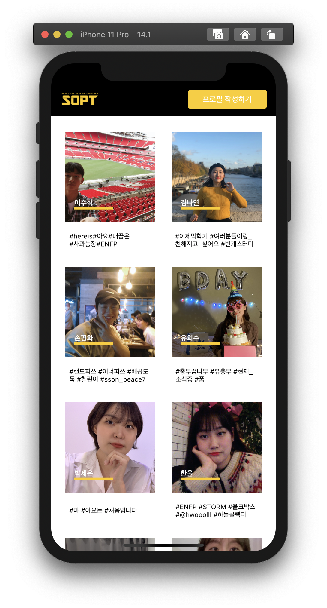
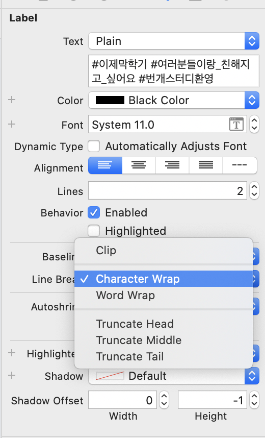

# 🍏 Sery's 27th SOPT iOS

## 27th SOPT iOS 소개

## 27th SOPT iOS conventions

### commit convention

> [Add Codes] - 새로운 코드를 추가했을 경우

> [Refactor Codes] - 기존에 작성한 코드를 수정했을 경우

> [Implement Features] - 새로운 기능을 추가하거나 완성했을 경우

> [Create UI] - 새로운 UI 파일을 생성했을 경우

> [Refactor UI] - UI 파일을 수정했을 경우 (오토 잡기, 설정 등등)

> [Fix Bugs] - 오류를 해결했을 경우

> [Chore] - 동작에 영향을 주는 코드 변경 없는 변경사항 (init, 주석, 정렬 등등)

> [Docs] - readme, wiki 작성한 경우

### foldering

> /Seminar - 세미나 내용을 복습하는 곳

> /Assignment - 과제를 수행하는 곳

> /img - readme에 첨부할 이미지를을 업로드하는 곳

 

## WEEK2 일지

### 🌿 2020/10/30 금

긴 문장을 담고 있는 Label에 제약을 주었을 때, 문장이 ...로 줄여 지는 현상을 해결하였다. 

  

 

StoryBoard 기준으로, 해당 Label의 Inspector Area에서 Line Break 설정을 찾았다.

디폴트 값으로 아마 Truncate Tail이 설정되어 있는데, 이는 문장의 tail 부분을 ...하겠다는 의미였다. 

따라서 해당 값을 Character Wrap으로 설정 하여 해결하였다. 

